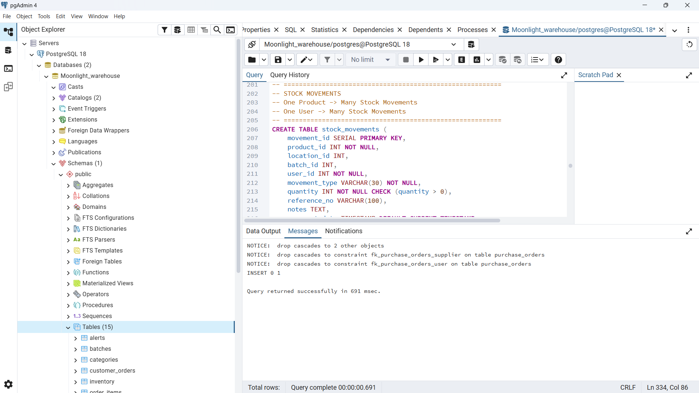
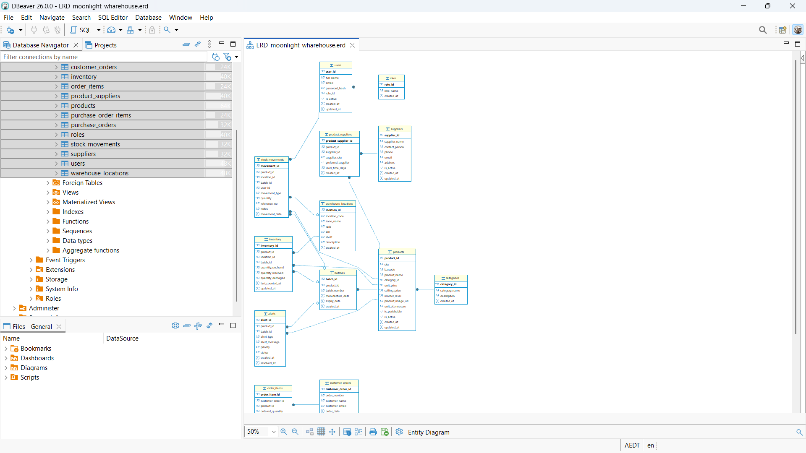
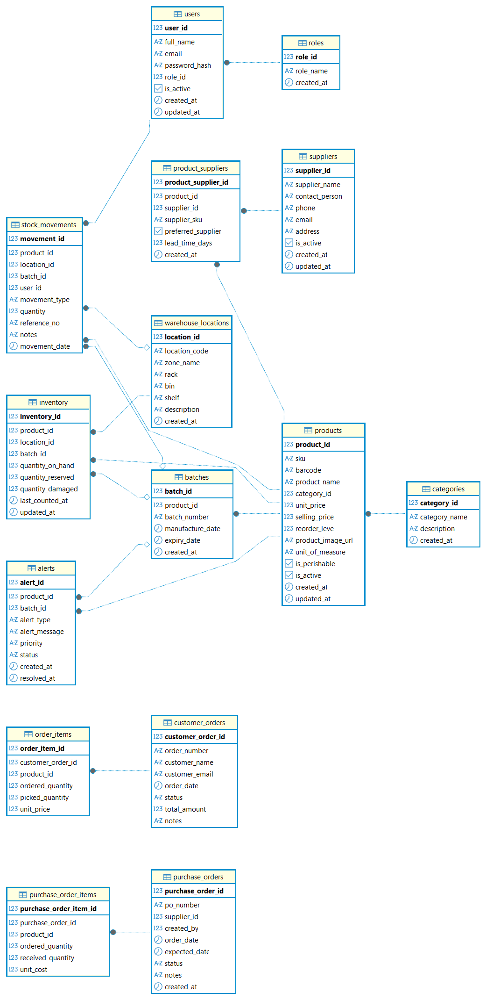
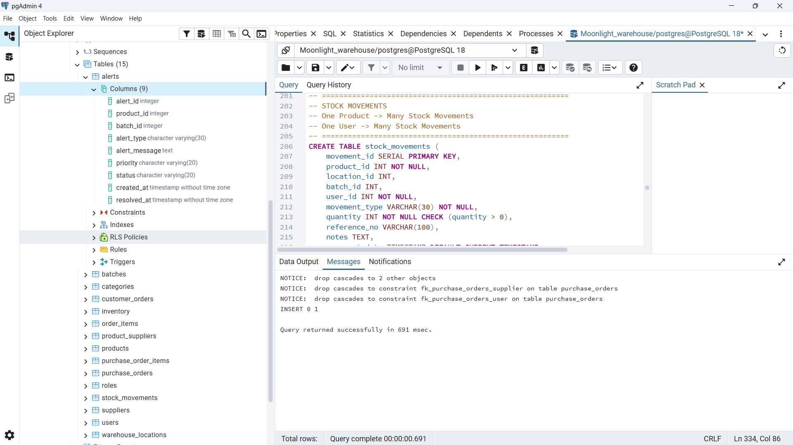

# ERD and Database Design

---

## Tools Used

- **[PostgreSQL](https://www.postgresql.org/)** — used as the main relational database management system
- **[pgAdmin 4](https://www.pgadmin.org/)** — used to create the database and execute the SQL schema
- **[DBeaver Community](https://dbeaver.io/)** — used to connect to PostgreSQL and generate the ER diagram through reverse engineering
- **[GitHub](https://github.com/)** — used for version control, project documentation, and storing database artifacts

---

## Overview

The database for the **Moonlight Warehouse Management System** was designed to support warehouse inventory operations for an Australian e-commerce grocery business. The schema was created in **PostgreSQL** and executed in **pgAdmin 4**, where the project database and tables were successfully created. After the schema was implemented, the same database was connected to **DBeaver Community Edition**, which was then used to automatically generate the **Entity Relationship Diagram (ERD)** through reverse engineering.

This process provided both a working relational database and a visual model of the data structure. The ERD clearly shows the entities, their attributes, and the relationships between them, making it easier to understand how the system stores and manages warehouse data.

---

## What is an ERD

An **Entity Relationship Diagram (ERD)** is a visual representation of the database structure. It shows:

- **Entities** — the major objects or tables in the database
- **Attributes** — the columns or fields inside each entity
- **Relationships** — the connections between entities using keys

The ERD is important because it helps explain how data is organized and how the database supports the functional requirements of the system.

---

## Explanation of Key Terms

### Entity
An **entity** is a table that represents an important object in the system.

Examples:
- `users`
- `roles`
- `products`
- `suppliers`
- `inventory`
- `batches`
- `stock_movements`
- `alerts`

### Attribute
An **attribute** is a column or field inside a table.

For example, the `products` entity contains attributes such as:
- `product_id`
- `sku`
- `barcode`
- `product_name`
- `category_id`
- `unit_price`
- `selling_price`

### Relationship
A **relationship** shows how one table is connected to another using primary keys and foreign keys.

Examples:
- one role can be linked to many users
- one category can contain many products
- one product can have many batches
- one product can be supplied by many suppliers through a junction table

---

## Database Development Process

The ERD and database were developed using the following process:

1. The main business data requirements were identified from the project analysis.
2. Core entities such as users, products, suppliers, categories, batches, inventory, and stock movements were defined.
3. Attributes for each entity were designed based on warehouse system needs.
4. Relationships were created using primary keys and foreign keys.
5. The SQL schema was written for PostgreSQL.
6. The schema was executed successfully in **pgAdmin 4**.
7. The PostgreSQL database was connected to **DBeaver**.
8. DBeaver was used to reverse engineer the database and automatically generate the ER diagram.
9. The final ERD was reviewed and stored as project evidence.

---

## Main Entities Included

The database design includes the following main entities:

- `roles`
- `users`
- `categories`
- `suppliers`
- `products`
- `product_suppliers`
- `warehouse_locations`
- `batches`
- `inventory`
- `stock_movements`
- `alerts`
- `customer_orders`
- `order_items`
- `purchase_orders`
- `purchase_order_items`

---

## Relationship Types in the ERD

### One-to-Many Relationships

The ERD includes the following one-to-many relationships:

- **roles → users**
- **categories → products**
- **products → batches**
- **products → inventory**
- **warehouse_locations → inventory**
- **batches → inventory**
- **products → stock_movements**
- **users → stock_movements**
- **warehouse_locations → stock_movements**
- **batches → stock_movements**
- **products → alerts**
- **batches → alerts**
- **customer_orders → order_items**
- **purchase_orders → purchase_order_items**

### Many-to-Many Relationship

The ERD also includes one many-to-many relationship:

- **products ↔ suppliers** through the `product_suppliers` junction table

This means one product can be supplied by many suppliers, and one supplier can provide many products.

---

## Proof of Work Screenshots

The following screenshots are included as evidence of the database and ERD creation process.

### 1. pgAdmin Database Creation / Query Execution
This screenshot shows the PostgreSQL database in pgAdmin 4 and confirms that the SQL schema was successfully executed.

### 2. DBeaver ER Diagram Generation
This screenshot shows the automatically generated ER diagram after reverse engineering the PostgreSQL schema in DBeaver.

### 3. Database Tables in pgAdmin
This screenshot shows the created tables inside the PostgreSQL database after successful schema execution.

---
