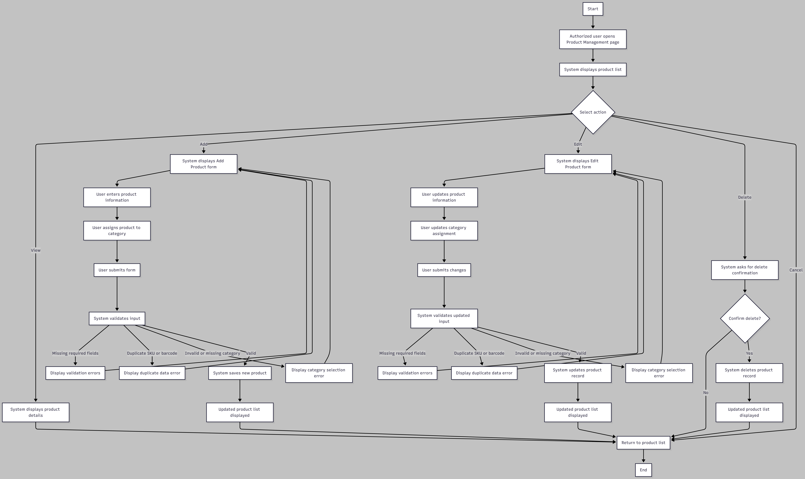
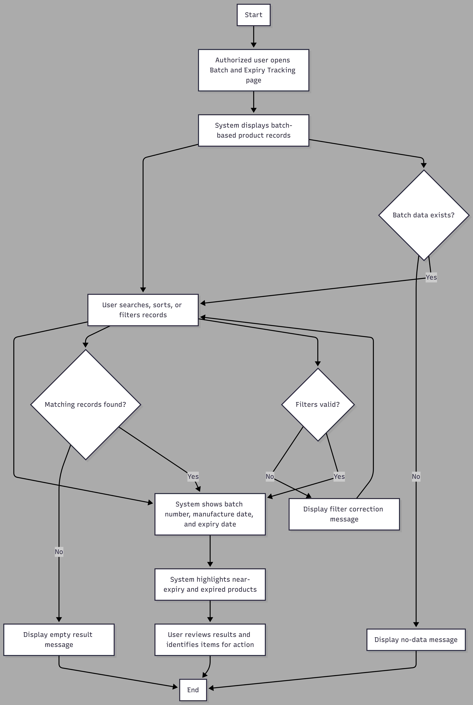
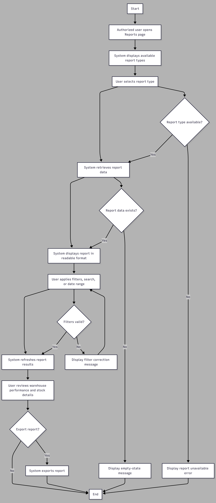

# UI/UX Design
## Moonlight Warehouse Management System

---

# 1. Introduction

This document explains the user interface and user experience design of the Moonlight Warehouse Management System. It focuses on how users interact with the system through key workflows such as login, product management, supplier management, stock movement, inventory adjustment, expiry tracking, and reporting. Each use case below includes a short explanation of how the workflow supports the system from a UI/UX perspective, followed by a reference screenshot or diagram stored in the repository.

---

# 2. Use Cases

## UC-01 User Login and Role-Based Access

**Actors:** Administrator, Warehouse Manager, Warehouse Staff  
**Description:** A user selects a role, enters login credentials, and accesses the system based on the authenticated account role. If the user account does not exist, the system provides an option to create a new account.

**Preconditions:**
- The login page is available
- The user must select a role before attempting login
- Existing users must already have an account in the system

**Postconditions:**
- Valid users are redirected to the correct dashboard based on their role
- Invalid users are shown an appropriate error message
- New users may create an account and return to the login page

### Main Flow
1. The user opens the login page
2. The user selects a role
3. The user enters email and password
4. The system checks whether the account exists
5. The system validates the password
6. The system checks whether the selected role matches the registered account role
7. The system creates a session or token
8. The system redirects the user to the correct dashboard

### Alternative Flows
- If no role is selected, the system asks the user to select a role
- If the account does not exist, the system offers account registration
- If the password is incorrect, the system displays an invalid credentials message
- If the selected role does not match the account role, the system displays a role mismatch message

### Explanation
This use case is important because login is the first interaction point between the user and the system. The UI must make role selection, credential input, and error handling clear and simple. From a user experience perspective, this workflow ensures that different user roles are redirected to the correct dashboard and are only allowed to access features relevant to their responsibilities.

### Reference Screenshot / Diagram

---

### UC-02 Manage Products

**Actors:** Administrator, Warehouse Manager  
**Description:** User creates, updates, views, or deletes product information, including assigning products to categories and maintaining key product details required for warehouse inventory management.

**Preconditions:**
- User is authenticated and authorized
- The product management page is available
- Categories required for assignment are available in the system

**Postconditions:**
- Product data is stored or updated successfully
- Product-category assignment is saved correctly
- The updated product list is displayed to the user

#### Main Flow
1. The user opens the product management page
2. The system displays the list of products
3. The user selects an action such as add, edit, view, or delete
4. The system displays the product form or product details
5. The user enters or updates product information, including category assignment
6. The user submits the data
7. The system validates the input
8. The system saves the product data
9. The system displays the updated product list

#### Alternative Flows
- If required product fields are missing, the system shows validation errors
- If a duplicate SKU or barcode is entered, the system displays an error message
- If the selected category is invalid or unavailable, the system asks the user to select a valid category
- If the user cancels the action, the system returns to the product list without saving changes
- If the user chooses delete, the system asks for confirmation before removing the product

#### Explanation
This use case supports one of the most important administrative functions in the system. The interface must allow authorized users to manage product records efficiently and accurately, including linking products to categories. Product forms should be well structured, validation messages should be clear, and the product list should be easy to search and review so that warehouse operations remain organized and consistent. This workflow directly supports the high-level requirements for product and category management and remains fully within the project scope.

### Reference Screenshot / Diagram

---

### UC-03 Manage Suppliers

**Actors:** Administrator, Warehouse Manager  
**Description:** User creates, updates, views, or deletes supplier records, including maintaining supplier contact details and supporting supplier-product relationships required for warehouse inventory operations.

**Preconditions:**
- User is authenticated and authorized
- The supplier management page is available

**Postconditions:**
- Supplier data is stored or updated successfully
- Supplier contact details are maintained correctly
- The updated supplier list is displayed to the user

#### Main Flow
1. The user opens the supplier management page
2. The system displays the supplier list
3. The user selects an action such as add, edit, view, or delete
4. The system displays the supplier form or supplier details
5. The user enters or updates supplier information
6. The user submits the data
7. The system validates the entered information
8. The system saves the supplier record
9. The system displays the updated supplier list

#### Alternative Flows
- If required supplier fields are missing, the system shows validation errors
- If invalid supplier contact details are entered, the system displays an error message
- If duplicate supplier information is entered where uniqueness is required, the system displays an error
- If the user cancels the action, the system returns to the supplier list without saving changes
- If the user selects delete, the system asks for confirmation before removing the supplier record

#### Explanation
This use case supports the structured management of supplier data, which is essential for warehouse and inventory operations. The interface should make it easy for authorized users to maintain supplier names, contact details, and related records in a clear and organized way. Well-designed forms, simple navigation, and strong validation help reduce errors and improve data quality. This workflow also supports future integration between suppliers and products within the warehouse management process.

### Reference Screenshot / Diagram
[View UC-03 Manage Suppliers](../charts/resources/uc-03-manage-suppliers.png)

---

### UC-04 Record Stock-In

**Actors:** Warehouse Staff, Warehouse Manager  
**Description:** User records newly received inventory into the system by entering product, quantity, warehouse location, batch details, and other receiving information.

**Preconditions:**
- User is authenticated and authorized
- The stock-in page is available
- Product exists in the system
- A valid warehouse location is available for storing the received stock

**Postconditions:**
- Inventory quantity increases successfully
- Stock movement is logged in the system
- Batch and expiry information is recorded where required
- Updated stock is reflected in the inventory page

#### Main Flow
1. The user opens the stock-in page
2. The system displays the stock-in form
3. The user selects the product being received
4. The user enters the quantity
5. The user selects the warehouse location
6. The user enters batch details and expiry-related data where required
7. The user submits the stock-in form
8. The system validates the entered information
9. The system updates the inventory quantity
10. The system creates a stock movement log
11. The updated stock is displayed in the inventory page

#### Alternative Flows
- If the selected product does not exist, the system prevents submission and shows an error
- If the quantity is missing, zero, or invalid, the system displays a validation error
- If the warehouse location is not selected, the system asks the user to select a valid location
- If the product is perishable and batch details are missing, the system requests batch and expiry information
- If the user cancels the action, the system returns to the previous page without saving data

#### Explanation
This use case supports one of the most important operational tasks in the warehouse system. The stock-in interface must allow users to quickly and accurately record newly received inventory while minimizing errors in quantity, location, and batch information. From a UI/UX perspective, the form should be simple, clearly labeled, and supported by validation messages that guide the user. This workflow helps maintain accurate inventory records, improves receiving efficiency, and ensures that perishable products are tracked correctly from the time they enter the warehouse.

#### Reference Screenshot / Diagram

---

### UC-05 Record Stock-Out

**Actors:** Warehouse Staff, Warehouse Manager  
**Description:** User records inventory leaving the warehouse by selecting the product, quantity, and warehouse location so that stock levels are updated accurately and outgoing movement is tracked.

**Preconditions:**
- User is authenticated and authorized
- The stock-out page is available
- Product exists in the system
- Sufficient stock is available in the selected location

**Postconditions:**
- Inventory quantity decreases successfully
- Stock movement is logged in the system
- Updated stock quantity is reflected in the inventory page

#### Main Flow
1. The user opens the stock-out page
2. The system displays the stock-out form
3. The user selects the product
4. The user enters the quantity to be issued
5. The user selects the warehouse location
6. The user submits the stock-out form
7. The system checks whether sufficient stock is available
8. The system validates the entered information
9. The system decreases the inventory quantity
10. The system creates a stock movement log
11. The updated stock quantity is displayed in the inventory page

#### Alternative Flows
- If the selected product does not exist, the system prevents submission and shows an error
- If available stock is insufficient, the system displays an insufficient stock error
- If the quantity is missing, zero, or invalid, the system displays a validation error
- If the warehouse location is not selected, the system asks the user to select a valid location
- If the user cancels the action, the system returns to the previous page without saving data

#### Explanation
This use case supports the outgoing movement of warehouse stock and is essential for maintaining accurate inventory levels. The interface should help staff perform stock-out actions clearly and safely by showing product details, available quantities, and location information before submission. Good UI design in this workflow reduces the risk of issuing too much stock, supports traceability through movement logging, and ensures that all outgoing inventory transactions are recorded consistently.

#### Reference Screenshot / Diagram

---

### UC-06 Adjust Inventory

**Actors:** Warehouse Manager  
**Description:** User adjusts stock levels for correction purposes by updating the inventory quantity for a selected product and location, while recording the reason for the change.

**Preconditions:**
- User is authenticated and authorized
- The inventory adjustment page is available
- The selected product exists in the system
- The selected warehouse location exists in the system

**Postconditions:**
- Inventory quantity is updated successfully
- The adjustment is logged with a reason
- The updated quantity is displayed in the inventory page

#### Main Flow
1. The warehouse manager opens the inventory adjustment page
2. The system displays the adjustment form
3. The manager selects the product
4. The manager selects the warehouse location
5. The manager enters the corrected quantity
6. The manager enters a reason for the adjustment
7. The manager submits the adjustment form
8. The system validates the entered information
9. The system updates the inventory record
10. The system logs the adjustment activity
11. The updated quantity is displayed in the inventory page

#### Alternative Flows
- If no reason is given, the system prevents submission and shows an error
- If the quantity is invalid, negative, or missing, the system displays a validation error
- If the product or location is not selected, the system asks the user to select valid records
- If the user exits or cancels without saving, no changes are made

#### Explanation
Inventory adjustment is a sensitive workflow because it directly changes stock records and may affect overall warehouse accuracy. The user interface should therefore require a clear reason, validate the entered quantity, and make the action traceable through a logged adjustment record. From a UI/UX perspective, this workflow supports accountability, prevents unsupported changes, and reduces the risk of accidental stock inconsistencies.

#### Reference Screenshot / Diagram

---

### UC-07 Track Expiry and Batches

**Actors:** Warehouse Manager, Warehouse Staff  
**Description:** User views batch and expiry data for perishable goods so that expired and near-expiry items can be identified quickly and managed appropriately.

**Preconditions:**
- User is authenticated and authorized
- The batch and expiry tracking page is available
- Batch data exists for relevant products

**Postconditions:**
- User can identify expired or near-expiry items
- Batch and expiry details are displayed clearly
- Users can review products that require follow-up action

#### Main Flow
1. The user opens the batch and expiry tracking page
2. The system displays batch-based product records
3. The user searches, sorts, or filters batch records
4. The system shows batch number, manufacture date, and expiry date
5. The system highlights near-expiry and expired products
6. The user reviews the results and identifies items that require action

#### Alternative Flows
- If no batch data exists, the system shows a no-data message
- If no matching product or batch is found, the system shows an empty result
- If filters are invalid or incomplete, the system requests correction
- If the user clears filters, the system reloads the full batch list

#### Explanation
This use case is especially important for grocery warehouse operations because many products are perishable and must be monitored carefully. The UI should make batch and expiry information easy to access through search, filtering, sorting, and visual warning indicators. Clear highlighting of near-expiry and expired products helps users quickly identify items that need urgent attention, reduces the risk of wastage, and improves stock control for perishable goods.

#### Reference Screenshot / Diagram

---

### UC-08 View Reports

**Actors:** Administrator, Warehouse Manager  
**Description:** User views stock, alert, and movement reports to monitor warehouse performance, inventory status, and operational activity.

**Preconditions:**
- User is authenticated and authorized
- The reports page is available
- Relevant report data exists in the system

**Postconditions:**
- User can review operational performance and stock status
- Selected report data is displayed in a readable format
- User may filter or export report results where supported

#### Main Flow
1. The user opens the reports page
2. The system displays available report types
3. The user selects a report type
4. The system retrieves the relevant report data
5. The report is displayed in a readable format
6. The user may apply filters, search criteria, or date ranges
7. The system refreshes the report results
8. The user reviews warehouse performance and stock details
9. The user may export the report if required

#### Alternative Flows
- If no report data exists, the system shows an empty-state message
- If invalid filters or date ranges are selected, the system requests correction
- If the selected report type is unavailable, the system shows an error message
- If export is attempted without available data, the system prevents the action

#### Explanation
Reports support decision-making by giving administrators and warehouse managers a clear view of stock levels, alerts, and movement history. The interface should present this information in a structured and readable format with useful filters, search options, and summaries. Good reporting design allows users to quickly understand warehouse performance, identify issues, and make better operational decisions based on current data.

#### Reference Screenshot / Diagram

---

# 3. Summary

The UI/UX design of the Moonlight Warehouse Management System is intended to support efficient and role-based interaction for the main warehouse workflows. Each use case above explains not only the functional flow, but also the user experience purpose behind the interface design. The linked diagrams and screenshots provide visual evidence of each workflow and help keep the project documentation organized and easy to follow.
